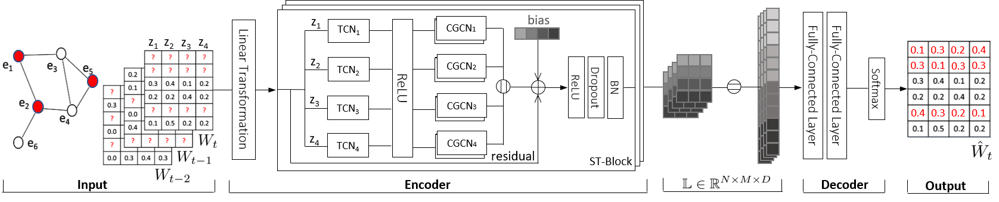

# SST-GCN

This is the python repository associated to the paper _Spatio-Temporal Graph Convolutional Networks for
Stochastic Traffic Speed Imputation_ [1]

The paper implements a method to estimate the missing speed distribution given a traffic dataset. 

General framework
 

### Requirements

The code is written in Python 3.7 and Pytorch. Specifically:

+ numpy==1.19.5
+ pyemd==0.5.1
+ scikit-learn==0.23.2
+ scipy==1.6.1
+ torch==1.7.1

### Dataset

The dataset is given already preprocessed on each fold (1-5). The raw data is described in [2]

The dataset is divided according to the missing information rate, e.g, _rm_0.5_ means that 50% of the speed distributions is missing during training.

The dataset is further divided according the number of edges of the road network subset, i.e., 173 and 40.

### Run

To run check first the parameters on the file _config.py_. Then, 

``
python run_cross_validation.py
``

This will run a full 5-fold-cross validation and return the evaluation metrics for each fold as well the average.

Please note that the package does not include implementations of baseline methods.

[1]: Carlos Muniz Cuza, Nguyen Ho, Eleni Tzirita Zacharatou, Torben Pedersen, Bin Yang. Spatio-Temporal Graph Convolutional Networks for
Stochastic Traffic Speed Imputation. ICDE 2021.

[2]: F. Guo, D. Zhang, Y. Dong, and Z. Guo, “Urban link travel speed dataset from a megacity road network,” Scientific data, vol. 6, no. 1, pp. 1–8, 2019.

